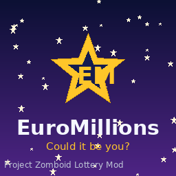

# EuroMillions — Apocalypse Lottery

A full Project Zomboid mod that brings the EuroMillions lottery to Knox County.
The world has ended, but the dream lives on: find play slips and scratchcards in
the loot, pick your **5 numbers and 2 Lucky Stars**, and survive long enough for
the **Tuesday & Friday** draws. Win survival loot... but claim a jackpot and
every walker for blocks around will come to congratulate you.

> *EuroMillions — Could it be you?*



---

## The fun mechanic: the Winner's Celebration

Cash is worthless after the outbreak, so prizes pay out in **survival loot**
dropped at your feet. The twist is the headline mechanic:

- **Small/medium wins** are quiet — food, water, smokes, ammo, a free Lucky Dip.
- **Match 5 (or better)** triggers the **Winner's Celebration**: sirens and
  fanfare blare, a fat loot drop lands at your feet — and the noise pulls a
  **horde of zombies** in from every direction to celebrate with you. The
  bigger the prize, the bigger the crowd. *Life-changing jackpots, life-ending
  parties.*

It turns "winning the lottery" into a genuine risk/reward decision: do you cash
in that jackpot ticket here, now — or carry it somewhere defensible first?

The celebration horde is fully configurable in the sandbox options (size
multiplier, or switch it off entirely for a pure-loot experience).

---

## How to play

### EuroMillions draws (the main event)
1. **Find a EuroMillions Play Slip** in shops, gas stations and magazine racks.
2. **Right-click → Fill Out Play Slip** (you need a **pen or pencil**):
   - **Choose Numbers…** opens a play slip UI — mark 5 numbers (1–50) and 2
     Lucky Stars (1–12).
   - **Lucky Dip (random)** fills a random line instantly.
3. Your ticket is entered into the **next Tuesday or Friday draw**.
4. On draw night (8pm), the **automated draw broadcast** announces the winning
   balls. Draw results are deterministic per in-game date, so they're identical
   for every player.
5. **Right-click your ticket → Check EuroMillions Ticket** on or after the draw.
   Match the 13 real EuroMillions prize tiers, from Match 2 (a free Lucky Dip)
   up to Match 5 + 2 Stars (the jackpot).

### Scratchcards (instant gratification)
Four families with different odds profiles:

| Card | Style |
|------|-------|
| **Gold Rush** | Lots of small wins |
| **Lucky Stars** | Mid-tier focused |
| **Triple 7** | High variance, big top prizes |
| **Millionaire Maker** | Rare chance of an *instant* jackpot celebration |

Right-click → **Scratch Card** for an immediate result.

### Branding & advertising
- Ambient EuroMillions slogans surface as you explore.
- Readable **EuroMillions Flyers** litter the world.
- Twice-weekly automated **draw broadcasts** with the winning numbers and the
  estimated (rolling, capped at €250M) jackpot.

---

## Items

| Item | Notes |
|------|-------|
| EuroMillions Play Slip | Blank — fill out to play a draw |
| EuroMillions Ticket | Your filled, dated entry — check it after the draw |
| Millionaire Maker / Lucky Stars / Gold Rush / Triple 7 Scratchcard | Instant-win cards |
| Used Scratchcard | Post-apocalyptic litter |
| EuroMillions Prize Voucher | Trophy awarded for big wins |
| EuroMillions Flyer | Readable advertising |

All items spawn naturally via the loot distribution (shop counters, gas-station
shelves, magazine racks, convenience stores).

---

## Installation

### From a local copy
Copy the `mods/EuroMillions` folder into your Zomboid mods directory:

- **Windows:** `%USERPROFILE%\Zomboid\mods\`
- **Linux:** `~/Zomboid/mods/`
- **macOS:** `~/Zomboid/mods/`

So you end up with `…/Zomboid/mods/EuroMillions/mod.info`. Enable
**EuroMillions — Apocalypse Lottery** in the in-game Mods menu.

### Steam Workshop packaging
For Workshop upload, wrap the mod as `Contents/mods/EuroMillions/…` under a
Workshop item folder alongside a `workshop.txt`. The `poster.png` is included.

---

## Sandbox options

Found under **EuroMillions Lottery** in the sandbox settings:

- **Winner's Celebration horde** — toggle the jackpot horde on/off.
- **Celebration horde size** — scale the crowd (0 = none, 1.0 = default,
  up to 4.0 for a very enthusiastic turnout).

---

## Multiplayer

The mod is **multiplayer-first**. In Project Zomboid MP the server owns world
state, so all payouts run server-side:

- Checking a ticket or scratching a card sends a command to the server
  (`sendClientCommand`). The **server** rolls scratch outcomes, re-derives ticket
  results authoritatively from the stored numbers + draw date, drops the prize
  loot, and spawns the Winner's Celebration horde — so every player sees them and
  they persist.
- The server replies to the winner with their result and **broadcasts a jackpot
  alert to everyone** on the server.
- The twice-weekly **draw broadcast is driven by the server clock** and sent to
  all connected players at once, so the whole server shares one set of winning
  numbers per draw.
- In **single-player**, the integrated server runs in the same Lua state, so the
  command round-trip is skipped and payouts happen locally — same behaviour, no
  networking overhead.

Client-owned actions (consuming a scratchcard, marking a ticket checked) stay on
the client where they sync naturally.

## Compatibility & notes

- Built for Project Zomboid Build 41 (`versionMin=41.65`); works on dedicated
  servers, co-op hosts and single-player.
- Draw results are seeded from the in-game calendar date, so they're consistent
  and reproducible across every client. PZ's lore start (Friday 9 July 1993) is
  a draw day.
- Prize payouts trust the requesting client's filled-in numbers but the **server
  re-derives the winning balls and prize tier**, so ticket results can't be
  forged by editing numbers. (Scratch outcomes are rolled entirely server-side.)

---

## Project layout

```
mods/EuroMillions/
  mod.info, poster.png
  media/
    scripts/euromillions.txt              -- item definitions
    sandbox-options.txt                   -- sandbox settings
    textures/                             -- item icons (generated)
    lua/
      shared/EuroMillions/EuroMillions_Shared.lua   -- rules, draws, tiers, prizes
      shared/Translate/EN/                -- tooltips + sandbox text
      client/EuroMillions_Prizes.lua      -- client messaging + command dispatch
      client/EuroMillions_Context.lua     -- right-click menu
      client/EuroMillions_TicketUI.lua    -- number-picker UI
      client/EuroMillions_Draw.lua        -- advertising + welcome
      client/timedactions/                -- scratch + fill-out actions
      server/EuroMillions_Server.lua      -- authoritative payout, horde, draws
      server/EuroMillions_Distribution.lua-- loot placement
tools/
  gen_textures.py                         -- regenerates the icons + poster
  test_logic.lua                          -- unit tests for the core logic
  test_mp.lua                             -- client/server round-trip tests
```

### Development

Regenerate art: `python3 tools/gen_textures.py` (needs Pillow).
Run tests: `luajit tools/test_logic.lua` and `luajit tools/test_mp.lua`
(the latter simulates the multiplayer client/server command round-trip).

---

*This is a fan-made parody mod for a free game. EuroMillions branding is
evoked for satire; all artwork in this repo is original. Please play
responsibly — winners may attract a crowd.*
